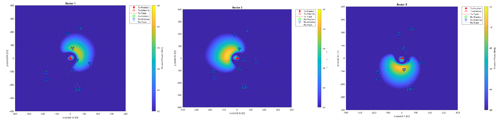

# FB_Quadriga
  Code repository for working on Quadriga simulations. The average time to run a simulation is usually around 30 minutes to 1 hour, so plan accordingly.
     

## Goals
  Ultimately, we need to generate realistic coverage data for use with intelligent algorithms. This data can look like power maps and/or     channel information and frequency response. 
     

## Current Issues I am working on
<ul>
  <li> The sectored antennas seem to be showing different radiation power depending on direction. See sector 1 in image below. </li>
  
  <li> Determine how to randomly place Rx_tracks while maintaining spacial consistency. </li>
  <li> Create system for generating many small powermaps with different scenarios, concatenating, and smoothing them. </li>
</ul>

  
